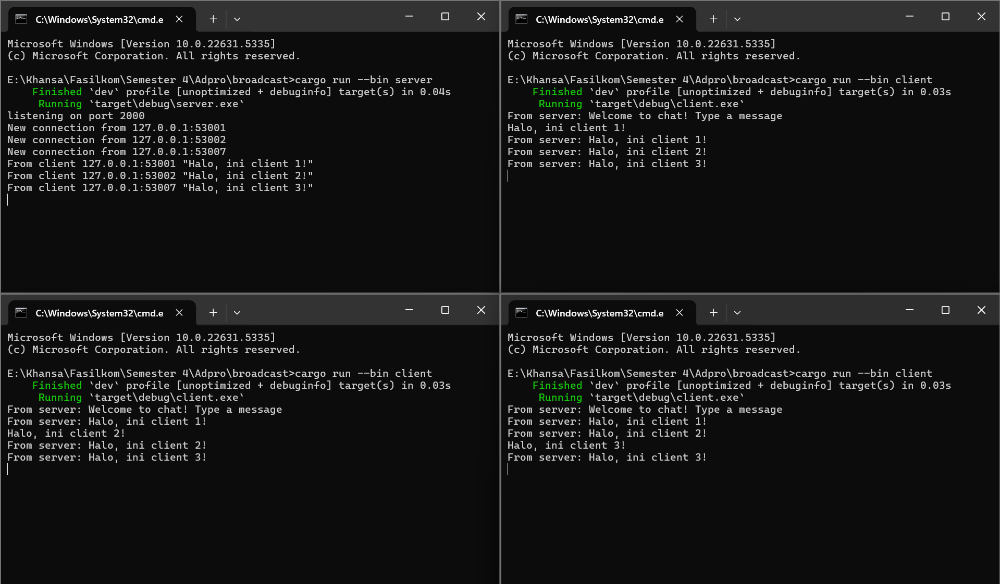
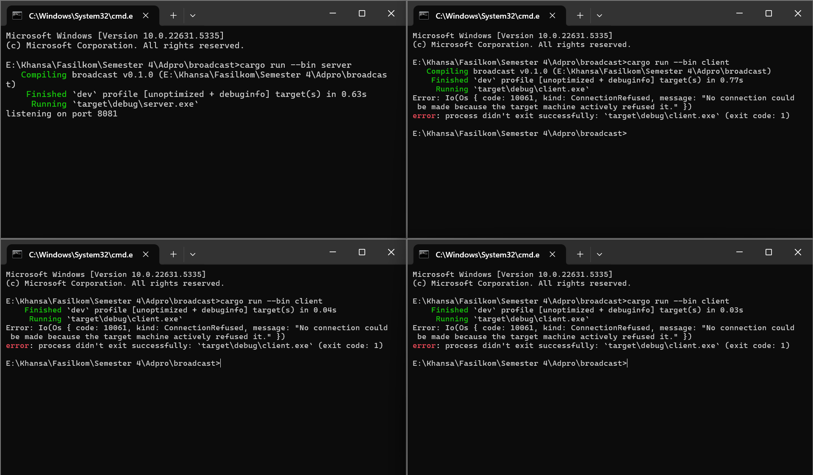
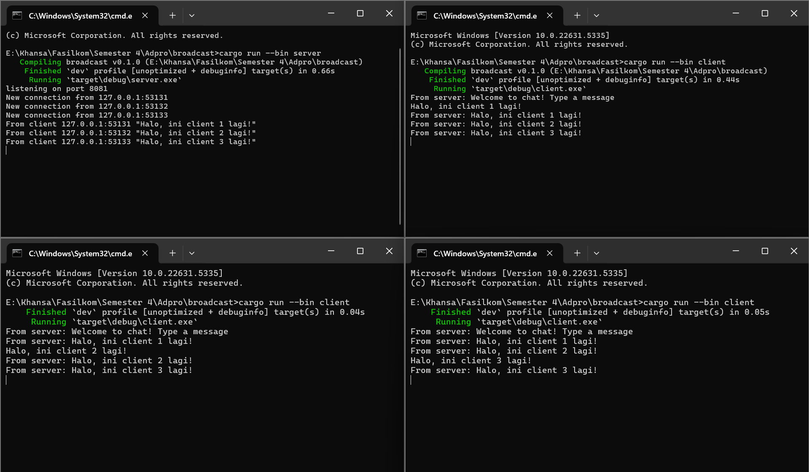
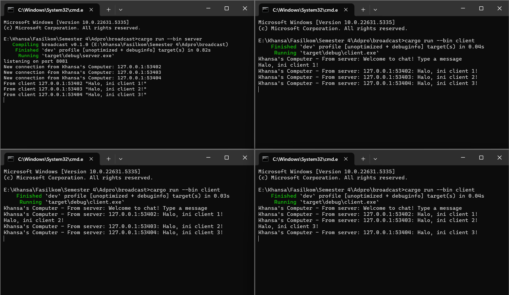

# Module 10 Tutorial: Asynchronous Programming

Advanced Programming (Even Semester 2024/2025) Tutorial Module 10

Khansa Khairunisa - 2306152462

## Reflection

### Experiment 2.1: Original code, and how it run

Berdasarkan gambar di atas, server dijalankan terlebih dahulu dengan perintah `cargo run --bin server` di direktori `broadcast`. Server akan mulai mendengarkan koneksi pada port 2000 dan akan mencatat setiap koneksi baru yang masuk dari client. Untuk menjalankan tiga client, perintah `cargo run --bin client` dijalankan secara terpisah di tiga terminal berbeda. Setiap client yang berhasil terhubung akan menerima pesan sambutan dari server berupa "Welcome to chat! Type a message", lalu dapat langsung mengetik pesan.

Saat salah satu client mengirimkan pesan, server akan menerima pesan tersebut dan mencatatnya bersamaan dengan informasi koneksi client yang mengirimkannya. Selanjutnya, server akan membroadcast pesan tersebut ke seluruh client yang sedang aktif, termasuk client pengirimnya sendiri. Dengan cara ini, seluruh client dapat saling melihat pesan yang dikirimkan oleh client lain. Hal ini dimungkinkan karena server menyimpan semua koneksi aktif dan mengelola pengiriman pesan ke setiap koneksi secara paralel.

### Experiment 2.2: Modifying port

Pada gambar pertama, terjadi error saat menjalankan `cargo run --bin client` karena client tidak berhasil terhubung ke server. Hal ini disebabkan oleh perbedaan port: server mendengarkan koneksi di port `8081`, sementara client mencoba terhubung ke port yang berbeda. Karena tidak ada server yang aktif di port tujuan yang dicoba oleh client, sistem menolak koneksi tersebut dan menampilkan pesan `ConnectionRefused`. Error ini menunjukkan bahwa meskipun client berjalan dengan benar, tidak ada proses server yang mendengarkan pada port yang dituju, sehingga koneksi gagal dilakukan.

Setelah port client disesuaikan agar sama dengan port server, yaitu sama-sama menggunakan 8081, koneksi antara client dan server berhasil terjalin. Setiap client yang dijalankan dapat terhubung dan menerima sambutan dari server, serta mengirimkan pesan. Server mencatat setiap koneksi baru, menerima pesan dari masing-masing client, dan membroadcast pesan tersebut ke seluruh client yang terhubung. Hasilnya, semua client dapat saling membaca pesan satu sama lain secara real-time. Ini menunjukkan bahwa komunikasi berbasis TCP berjalan dengan baik selama client dan server berada pada port yang sama.

### Experiment 2.3: Small changes, add IP and Port

Berdasarkan gambar di atas, terlihat bahwa setiap pesan yang diterima oleh client kini disertai informasi alamat pengirim, yakni IP dan port dari client yang mengirimkan pesan tersebut. Hal ini dimungkinkan karena kode pada `server.rs` telah dimodifikasi: semula hanya mengirim isi pesan `(text.into())`, sekarang diubah menjadi `format!("{addr:?}: {text:?}")` sebelum dikirim melalui `bcast_tx.send()`. Perubahan ini memungkinkan server untuk menyisipkan metadata alamat pengirim ke dalam isi pesan yang akan dikirim ke seluruh client. Selain itu, tampilan di terminal client juga diperjelas dengan tambahan teks `Khansa's Computer - From server:` pada bagian `client.rs` agar setiap pesan yang diterima dari server dapat dikenali dengan mudah dan konteks sumber pesannya lebih jelas.